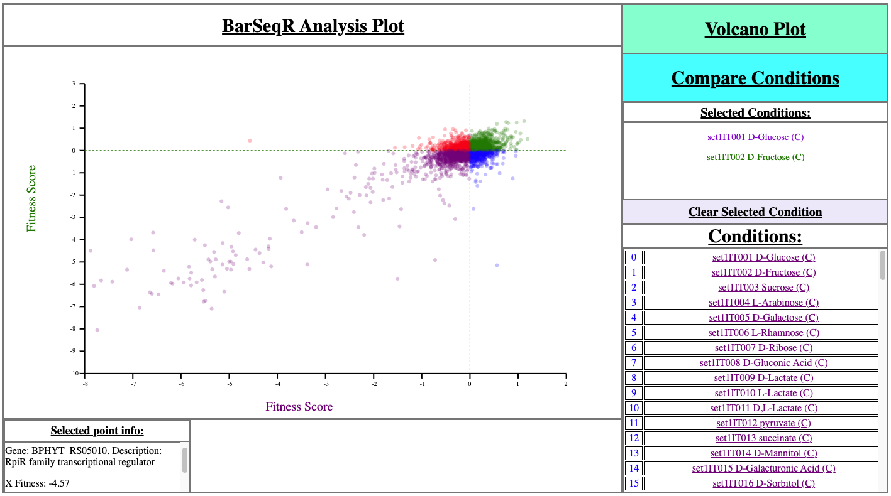
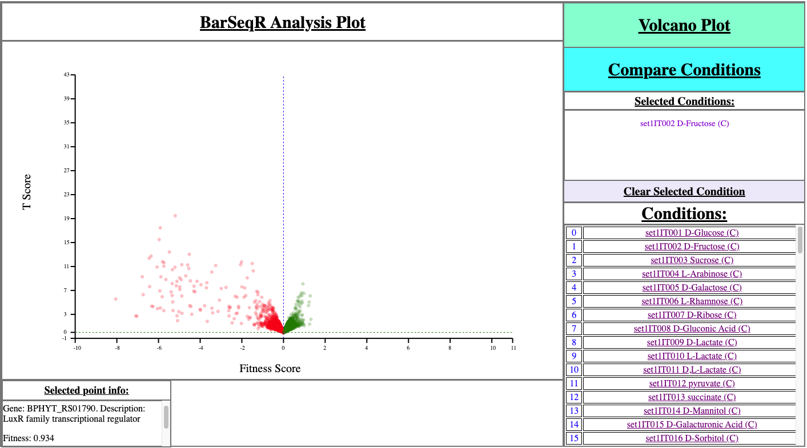

# BarSeqR Visualization
* (README Incomplete )

## Inputs
* Organism fitness score data in TSV format (e.g. organism_fitness.tsv)
* Organism t score data in TSV format (e.g. organism_t_scores.tsv)
* Organism Name
* Column number at which Conditions start (normally '5', (0-indexed))
* Output directory in which to create new HTML directory (e.g. newHTMLdir_path)

## How to run:
```shell
python3 make_BarSeqR_html_dir.py newHTMLdir_path organism_fitness.tsv organism_t_scores.tsv organism_name Column_number 1
```
* You'll need a browser that can run Javascript, e.g. Chrome, Firefox, Opera, Safari

## Example Using Sample Data
```shell
python3 make_BarSeqR_html_dir.py BFirmHTML SampleDATA/fit_organism_BFirm.tsv \
SampleDATA/t_organism_BFirm.tsv BFirm 5 1
```
* We run the program on existing BFirm data and create a directory at BFirmHTML

## How to use:
1. Volcano Plot:
    * Choose a condition, then click on 'Volcano Plot'
2. Compare Conditions:
    * Choose two conditions, then click on 'Compare Conditions'
* You can click on any point to get its detailed info in the bottom
    left corner of the visualization box.


### Examples:


### Images:


